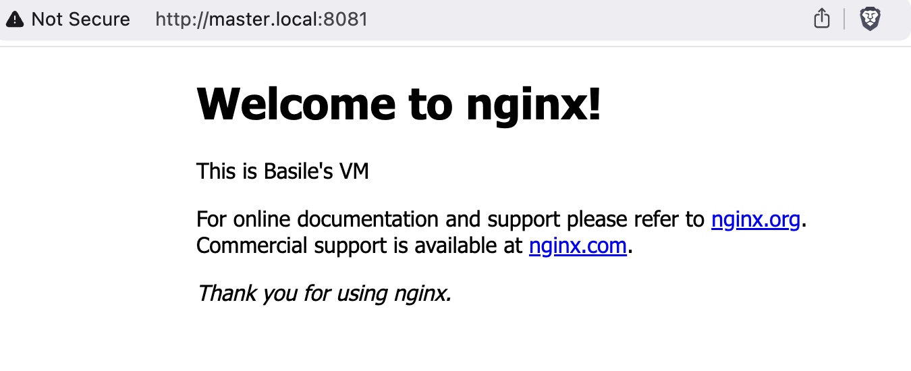

# TD3
Basile LE THIEC
RT31

## Exercice 1
### Partie 1
1. 
```bash
toto@debian ~/Documents/R511/TP3/exo1 main vagrant init ubuntu/focal64
```

2. 
```bash
toto@debian ~/Documents/R511/TP3 main vagrant port                                 
The forwarded ports for the machine are listed below. Please note that
these values may differ from values configured in the Vagrantfile if the
provider supports automatic port collision detection and resolution.

    22 (guest) => 2222 (host)
    80 (guest) => 8081 (host)
```

6. 
J'ai utilisé le port `8081` pour accéder à la page web de la VM.
`http://localhost:8081/`

7. 
La commande `vagrant ssh -c "hostname -I | cut -d' ' -f2"` permet de voir l'IP de la VM sans y accéder directement.

```bash
toto@debian ~/Documents/R511/TP3/exo1 main vagrant ssh -c "hostname -I | cut -d' ' -f2"
192.168.56.4
```

8. 
Le dossier html est ajouté dans le dossier de partage de l'hôte.
```bash
toto@debian ~/Documents/R511/TP3/exo1 main ll
total 24
drwxr-xr-x 4 toto toto 4096 Oct 23 11:08 .
drwxr-xr-x 3 toto toto 4096 Oct 23 11:08 ..
drwxr-xr-x 2 toto toto 4096 Oct 23 11:03 html
-rwxr-xr-x 1 toto toto  340 Oct 23 11:05 init.sh
drwxr-xr-x 5 toto toto 4096 Oct 23 10:49 .vagrant
-rw-r--r-- 1 toto toto 3454 Oct 23 10:59 Vagrantfile
```
9. 


### Partie 2
1. 
```bash
toto@debian ~/Documents/R511/TP3/exo1 main vagrant snapshot save snap1
==> default: Snapshotting the machine as 'snap1'...
==> default: Snapshot saved! You can restore the snapshot at any time by
==> default: using `vagrant snapshot restore`. You can delete it using
==> default: `vagrant snapshot delete`.
toto@debian ~/Documents/R511/TP3/exo1 main vagrant snapshot list
==> default: 
snap1
```

2. 
```bash
toto@debian ~/Documents/R511/TP3/exo1 main vagrant ssh
vagrant@ubuntu-focal:~$ sudo apt-get update
vagrant@ubuntu-focal:~$ sudo apt-get install bind9 -y
vagrant@ubuntu-focal:~$ sudo systemctl status bind9
● named.service - BIND Domain Name Server
     Loaded: loaded (/lib/systemd/system/named.service; enabled; vendor preset: enabled)
     Active: active (running) since Wed 2024-10-23 09:38:21 UTC; 15s ago
       Docs: man:named(8)
   Main PID: 2711 (named)
      Tasks: 6 (limit: 2324)
     Memory: 7.2M
     CGroup: /system.slice/named.service
             └─2711 /usr/sbin/named -f -u bind
```

3. 
```bash
toto@debian ~/Documents/R511/TP3/exo1 main vagrant snapshot save snap2
==> default: Snapshotting the machine as 'snap2'...
==> default: Snapshot saved! You can restore the snapshot at any time by
==> default: using `vagrant snapshot restore`. You can delete it using
==> default: `vagrant snapshot delete`.
```

4. 
```bash
toto@debian ~/Documents/R511/TP3/exo1 main vagrant snapshot restore snap1
==> default: Forcing shutdown of VM...
==> default: Restoring the snapshot 'snap1'...
==> default: Checking if box 'ubuntu/focal64' version '20240821.0.1' is up to date...
==> default: Resuming suspended VM...
==> default: Booting VM...
```

```bash
vagrant@ubuntu-focal:~$ sudo systemctl status bind9
Unit bind9.service could not be found.
```

5. 
```bash
toto@debian ~/Documents/R511/TP3/exo1 main vagrant snapshot restore snap2
==> default: Forcing shutdown of VM...
==> default: Restoring the snapshot 'snap2'...
==> default: Checking if box 'ubuntu/focal64' version '20240821.0.1' is up to date...
==> default: Resuming suspended VM...
==> default: Booting VM...
```

```bash
vagrant@ubuntu-focal:~$ sudo systemctl status bind9
● named.service - BIND Domain Name Server
     Loaded: loaded (/lib/systemd/system/named.service; enabled; vendor preset: enabled)
     Active: active (running) since Wed 2024-10-23 09:38:21 UTC; 5min ago
       Docs: man:named(8)
   Main PID: 2711 (named)
      Tasks: 8 (limit: 2324)
     Memory: 7.4M
     CGroup: /system.slice/named.service
             └─2711 /usr/sbin/named -f -u bind
```

6. 
```bash
toto@debian ~/Documents/R511/TP3/exo1 main vagrant snapshot delete snap1        
vagrant snapshot delete snap2
==> default: Deleting the snapshot 'snap1'...
==> default: Snapshot deleted!
==> default: Deleting the snapshot 'snap2'...
==> default: Snapshot deleted!
toto@debian ~/Documents/R511/TP3/exo1 main vagrant snapshot list
==> default: No snapshots have been taken yet!
```

## Exercice 2
1. 
```bash
toto@debian ~/Documents/R511/TP3 main mkdir exo2 && cd exo2
toto@debian ~/Documents/R511/TP3/exo2 main vagrant init
```

5. 
```bash
toto@debian ~/Documents/R511/TP3/exo2 main vagrant ssh web                             
vagrant@web-server:~$ sudo systemctl status apache2
● apache2.service - The Apache HTTP Server
   Loaded: loaded (/lib/systemd/system/apache2.service; enabled; vendor preset: enabled)
  Drop-In: /lib/systemd/system/apache2.service.d
           └─apache2-systemd.conf
   Active: active (running) since Wed 2024-10-23 09:59:02 UTC; 41min ago
 Main PID: 13881 (apache2)
    Tasks: 55 (limit: 1109)
   CGroup: /system.slice/apache2.service
           ├─13881 /usr/sbin/apache2 -k start
           ├─13883 /usr/sbin/apache2 -k start
           └─13884 /usr/sbin/apache2 -k start
```

```bash
toto@debian ~/Documents/R511/TP3/exo2 main vagrant ssh mysql                             
vagrant@db-server:~$ sudo systemctl status mysql
● mysql.service - MySQL Community Server
   Loaded: loaded (/lib/systemd/system/mysql.service; enabled; vendor preset: enabled)
   Active: active (running) since Wed 2024-10-23 10:38:16 UTC; 2min 42s ago
 Main PID: 14219 (mysqld)
    Tasks: 27 (limit: 1109)
   CGroup: /system.slice/mysql.service
           └─14219 /usr/sbin/mysqld --daemonize --pid-file=/run/mysqld/mysqld.pid
```

6. 
```bash
vagrant@db-server:~$ ping 192.168.56.10
PING 192.168.56.10 (192.168.56.10) 56(84) bytes of data.
64 bytes from 192.168.56.10: icmp_seq=1 ttl=64 time=0.808 ms
64 bytes from 192.168.56.10: icmp_seq=2 ttl=64 time=0.632 ms
64 bytes from 192.168.56.10: icmp_seq=3 ttl=64 time=0.461 ms
```
`192.168.56` étant l'IP du serveur web définie dans le Vagrantfile.

## Exercice 3
1. 
```bash
toto@debian ~/Documents/R511/TP3 main mkdir exo3 && cd exo3
toto@debian ~/Documents/R511/TP3/exo3 main vagrant init
```

5. 
```bash
toto@debian ~/Documents/R511/TP3/exo3 main vagrant ssh server
vagrant@dhcp-server:~$ sudo systemctl status isc-dhcp-server
● isc-dhcp-server.service - ISC DHCP IPv4 server
     Loaded: loaded (/lib/systemd/system/isc-dhcp-server.service; enabled; vendor preset: enabled)
     Active: active (running) since Wed 2024-10-23 11:10:34 UTC; 27s ago
       Docs: man:dhcpd(8)
   Main PID: 4971 (dhcpd)
      Tasks: 4 (limit: 1117)
     Memory: 4.6M
     CGroup: /system.slice/isc-dhcp-server.service
             └─4971 dhcpd -user dhcpd -group dhcpd -f -4 -pf /run/dhcp-server/dhcpd.pid -cf /etc/dhcp/dhcpd.conf
```

6. 
```bash
toto@debian ~/Documents/R511/TP3/exo3 main vagrant ssh client
vagrant@dhcp-client:~$ ip a
3: enp0s8: <BROADCAST,MULTICAST,UP,LOWER_UP> mtu 1500 qdisc fq_codel state UP group default qlen 1000
    link/ether 08:00:27:13:b1:1d brd ff:ff:ff:ff:ff:ff
    inet 192.168.1.10/24 brd 192.168.1.255 scope global dynamic enp0s8
       valid_lft 476sec preferred_lft 476sec
    inet6 fe80::a00:27ff:fe13:b11d/64 scope link 
       valid_lft forever preferred_lft forever
```
